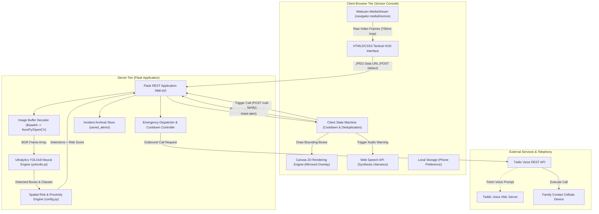
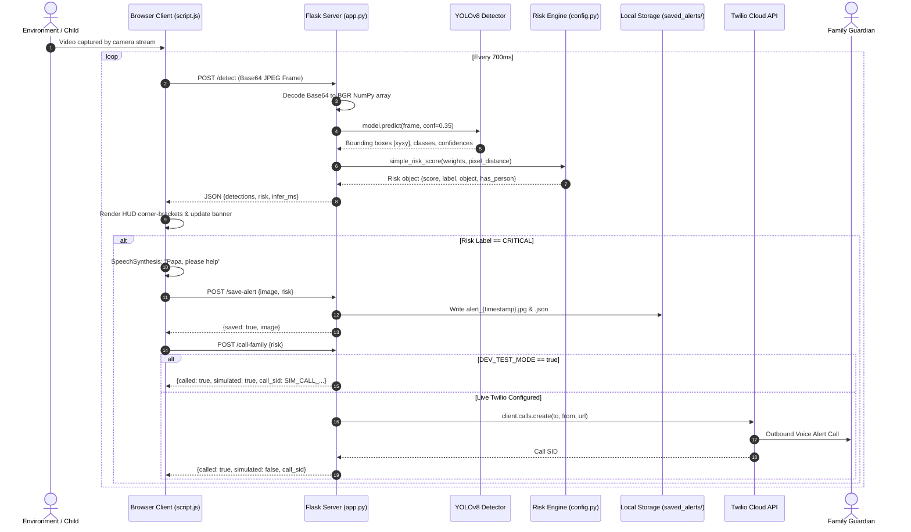

# SafeNest AI — Intelligent Child Safety & Hazard Monitoring Console

[](https://www.python.org/)
[](https://flask.palletsprojects.com/)
[](https://docs.ultralytics.com/)
[](https://opencv.org/)
[](https://www.twilio.com/)
[](https://www.docker.com/)
[](https://render.com/)

**SafeNest AI** is an edge-assisted, real-time computer vision system engineered to safeguard infants and young children in household environments. By marrying client-side webcam streaming with server-side object detection, spatial proximity assessment, and automated escalation channels, SafeNest AI identifies dangerous objects, computes instantaneous hazard scores, and autonomously alerts caregivers before accidents occur.

---

## Table of Contents

- [Key Features](#key-features)
- [System Architecture](#system-architecture)
  - [High-Level Architecture Diagram](#high-level-architecture-diagram)
  - [End-to-End Data Flow Sequence](#end-to-end-data-flow-sequence)
  - [Component & Subsystem Breakdown](#component--subsystem-breakdown)
  - [Mathematical Risk Formulation](#mathematical-risk-formulation)
- [Hazard Taxonomy & Scoring Engine](#hazard-taxonomy--scoring-engine)
- [Project Directory Structure](#project-directory-structure)
- [REST API Reference](#rest-api-reference)
- [Getting Started & Installation](#getting-started--installation)
  - [Prerequisites](#prerequisites)
  - [Local Installation](#local-installation)
  - [Environment Configuration](#environment-configuration)
  - [Running the Server](#running-the-server)
- [Twilio Voice Integration & Dev Simulation](#twilio-voice-integration--dev-simulation)
- [Docker & Cloud Deployment](#docker--cloud-deployment)
- [Browser Security & Camera Policies](#browser-security--camera-policies)
- [Roadmap & Development Phases](#roadmap--development-phases)

---

## Key Features

- **Real-Time Computer Vision Inference**: Powered by YOLOv8 Nano (`yolov8n.pt`) with optimized CPU inference (~100–180ms per frame).
- **Proximity-Aware Spatial Risk Engine**: Evaluates Euclidean pixel distance between detected persons and hazards, elevating threat levels when a child moves closer to dangerous items.
- **Dynamic Tactical HUD Console**: Hardware-accelerated Canvas overlay rendering corner-bracket bounding boxes, color-coded danger highlights, mirrored horizontal coordinate adjustments, and an animated scanline.
- **Multimodal Emergency Escalation**:
  - **Auditory Warning**: Client-side text-to-speech synthesize voice alerts: *"Emergency alert. [Hazard] detected. Papa, please help."*
  - **Automated Voice Calls**: Server-side Twilio REST client calls designated family phone numbers upon reaching `CRITICAL` risk.
  - **Zero-Cost Developer Simulation**: Built-in `DEV_TEST_MODE` mocks outbound telecom calls with synthetic Call SIDs without incurring API charges.
  - **Incident Archival**: Automatically captures high-resolution snapshot JPEGs and JSON metadata into `saved_alerts/` for forensic review.
- **Anti-Spam & Hysteresis Protection**: Integrated 25-second cooldown timer prevents duplicate outbound phone calls while persistent threats remain in view.
- **Production & Cloud Ready**: Fully containerized with Docker and configured with Render blueprints (`render.yaml`) for zero-friction cloud deployment.

---

## System Architecture

SafeNest AI employs a decoupled client-server architecture balancing lightweight client execution with deep-learning inference on the server.

### High-Level Architecture Diagram



---

### End-to-End Data Flow Sequence



---

### Component & Subsystem Breakdown

#### 1. Presentation & Sensor Console Layer
- **HUD Interface ([index.html](file:///c:/Users/princ/Documents/GitHub/SafeNest/index.html))**: Dark-themed console UI featuring a live camera viewport, interactive camera toggle, detection feed list, live event logger, and family phone settings.
- **Canvas Overlay Engine ([script.js](file:///c:/Users/princ/Documents/GitHub/SafeNest/script.js))**:
  - Employs dual canvases: a hardware-mirrored display canvas for user feedback and an offscreen canvas to extract unmirrored raw JPEG frames.
  - Automatically reverses normalized bounding box $x$-coordinates (`x1 = (1 - nx2) * width`) to mirror feed orientation.
  - Renders corner-bracket bounding markers and high-contrast labels.
- **Client State Machine ([script.js](file:///c:/Users/princ/Documents/GitHub/SafeNest/script.js))**:
  - Manages a 700ms polling cycle (`SEND_INTERVAL_MS`).
  - Implements a 25-second alert cooldown timer (`alertCooldownTimer`) to suppress alert storms.
  - Controls local storage caching for guardian contact details.

#### 2. Server API & Orchestration Layer
- **Flask REST Application ([app.py](file:///c:/Users/princ/Documents/GitHub/SafeNest/app.py))**:
  - Serves static assets and sensor console templates.
  - Loads environment settings from `.env` via multi-format regex parser supporting standard `.env`, `export`, and PowerShell `$env:` syntax.
  - Hosts endpoints for detection (`/detect`), alert persistence (`/save-alert`), and emergency calling (`/call-family`).

#### 3. Computer Vision & Inference Layer
- **Ultralytics YOLOv8 ([yolov8n.pt](file:///c:/Users/princ/Documents/GitHub/SafeNest/yolov8n.pt))**:
  - Pretrained on the COCO dataset covering 80 common object classes.
  - Executes inference with a calibrated confidence threshold (`CONF_THRESHOLD = 0.35`).
  - Normalizes coordinate outputs $[x_1, y_1, x_2, y_2] \in [0, 1]$ across arbitrary screen resolutions.

#### 4. Spatial Risk Assessment Engine
- **Spatial Metric Matrix ([config.py](file:///c:/Users/princ/Documents/GitHub/SafeNest/config.py))**:
  - Identifies hazard categories: `PERSON_CLASSES`, `DANGEROUS_CLASSES`, and `NEUTRAL_HIGHLIGHT_CLASSES`.
  - Evaluates bounding box geometric centroids:
    $$\text{center} = \left(\frac{x_1 + x_2}{2}, \frac{y_1 + y_2}{2}\right)$$
  - Calculates 2D Euclidean distance $d(p_1, p_2)$ between detected individuals and hazardous targets.
  - Computes continuous risk scores and categorizes threats into discrete action levels.

#### 5. Telephony & Escalation Subsystem
- **Twilio Voice Integration ([app.py](file:///c:/Users/princ/Documents/GitHub/SafeNest/app.py))**:
  - Authenticates securely against Twilio's REST API using backend environment secrets.
  - Dispatches calls via Twilio Voice using public XML voice instructions (`TWILIO_TWIML_URL`).
  - Features fully sandboxed developer simulation (`DEV_TEST_MODE=true`) returning synthetic call identifiers.

---

### Mathematical Risk Formulation

The risk engine computes threat severity based on **intrinsic danger weight** ($W \in [0, 100]$) and **spatial proximity** ($d_{\text{px}}$) calibrated for a 960×720 viewport:

#### 1. Proximity Scaling Factor ($P_f$)
When both a person and a hazard are co-present in the monitored frame:

$$d = \sqrt{(x_{\text{person}} - x_{\text{hazard}})^2 + (y_{\text{person}} - y_{\text{hazard}})^2}$$

$$P_f(d) = \begin{cases} 
1.00 & \text{if } d \le 400\text{ px} \quad (\text{High-Risk Proximity Zone}) \\ 
0.85 & \text{if } 400\text{ px} < d \le 700\text{ px} \quad (\text{Warning Proximity Zone}) \\ 
0.75 & \text{if } d > 700\text{ px} \quad (\text{Distant Zone}) 
\end{cases}$$

$$\text{Score} = \text{round}(W \times P_f(d), 1)$$

#### 2. Standalone Hazard Scaling
If a hazardous object is present in the monitored scene without an identified person:

$$\text{Score} = \text{round}(W \times 0.8, 1)$$

#### 3. Threat Classification Tiers

| Score Range | Severity Label | Visual Indicator | System Action |
|:---:|:---:|:---:|:---|
| **70.0 – 100.0** | `CRITICAL` | Flashing Red (`#E6383D`) | Audio Speech Alert + Local Snapshot Archival + Twilio Emergency Call |
| **45.0 – 69.9** | `HIGH RISK` | Orange (`#E8742F`) | Visual HUD Alert + Moment Snapshot Cached in Memory |
| **20.0 – 44.9** | `WARNING` | Amber (`#E8B93B`) | Event Log Warning Entry |
| **0.0 – 19.9** | `SAFE` | Green (`#2FBF71`) | Standard Monitoring Mode |

---

## Hazard Taxonomy & Scoring Engine

Hazard classes and baseline weights configured in [config.py](file:///c:/Users/princ/Documents/GitHub/SafeNest/config.py):

| Category | Class Names / Aliases | Base Weight ($W$) | Risk Justification |
|:---|:---|:---:|:---|
| **Sharp & Cutting** | `knife`, `scissors`, `sharp tool` | **90 – 95** | High risk of laceration or acute physical injury. |
| | `tool`, `fork` | **75 – 85** | Puncture, stabbing, or blunt trauma hazard. |
| **Heat, Fire & Gas** | `open flame`, `fire`, `gas stove`, `stove`, `burner`, `gas burner` | **90 – 95** | Severe thermal burn, combustion, or asphyxiation risk. |
| | `oven`, `toaster`, `microwave` | **75 – 85** | Electrical heating surfaces and entrapment danger. |
| **Electrical** | `electrical socket`, `socket`, `outlet` | **90** | Electrocution and live-current hazard. |
| | `battery`, `hair drier` | **75 – 85** | Chemical leakage, ingestion hazard, or high-draw immersion danger. |
| **Chemical & Ingestion**| `medicine`, `pill`, `pills` | **90** | Accidental poisoning and toxic pharmacological ingestion. |
| | `chemical`, `cleaning bottle`, `chemical bottle`, `bottle` | **75 – 85** | Caustic household chemical ingestion or eye irritation. |
| **Minor Hazards** | `cell phone` | **25** | Choking proxy or minor distraction factor. |
| **Neutral References** | `teddy bear`, `chair`, `couch`, `bed`, `dining table`, `cup`, `bowl`, `book`, `clock` | **0** | Contextual background objects rendered in neutral gray for spatial awareness. |

---

## Project Directory Structure

```
SafeNest/
├── app.py                  # Flask backend server, REST endpoints & Twilio integration
├── config.py               # Hazard classification taxonomy, danger weights & risk formulas
├── index.html              # Frontend tactical HUD console interface
├── script.js               # Client camera pipeline, canvas overlay, audio & event handler
├── style.css               # Futuristic cyberpunk / tactical HUD console styling
├── yolov8n.pt              # Pretrained Ultralytics YOLOv8 Nano neural network weights
├── requirements.txt        # Python dependency manifest
├── Dockerfile              # Production multi-stage Docker build recipe
├── render.yaml             # Render Cloud deployment infrastructure blueprint
├── .env.example            # Environment variables template
├── .dockerignore           # Build exclusion rules for Docker daemon
└── saved_alerts/           # Generated runtime directory storing alert JPEGs and JSON metadata
```

---

## REST API Reference

### 1. `POST /detect`
Processes an incoming camera frame, executes YOLOv8 object detection, and returns spatial risk calculations.

- **Request Body**:
  ```json
  {
    "image": "data:image/jpeg;base64,/9j/4AAQSkZJRg..."
  }
  ```
- **Response (`200 OK`)**:
  ```json
  {
    "detections": [
      {
        "class": "knife",
        "category": "danger",
        "conf": 0.892,
        "box": [0.35, 0.42, 0.48, 0.61]
      },
      {
        "class": "person",
        "category": "person",
        "conf": 0.941,
        "box": [0.20, 0.15, 0.65, 0.88]
      }
    ],
    "risk": {
      "score": 95.0,
      "label": "CRITICAL",
      "object": "knife",
      "has_person": true
    },
    "infer_ms": 138.4
  }
  ```

---

### 2. `POST /save-alert`
Persists a critical alert snapshot image alongside risk metadata to the server disk.

- **Request Body**:
  ```json
  {
    "image": "data:image/jpeg;base64,/9j/4AAQSkZJRg...",
    "risk": {
      "score": 95.0,
      "label": "CRITICAL",
      "object": "knife"
    }
  }
  ```
- **Response (`200 OK`)**:
  ```json
  {
    "saved": true,
    "image": "alert_20261005T052814123456Z.jpg"
  }
  ```

---

### 3. `POST /call-family`
Dispatches an emergency voice phone call to the designated family contact via Twilio or development simulation.

- **Request Body**:
  ```json
  {
    "risk": {
      "score": 95.0,
      "label": "CRITICAL",
      "object": "knife"
    }
  }
  ```
- **Response (`200 OK`)**:
  ```json
  {
    "called": true,
    "call_sid": "CAxxxxxxxxxxxxxxxxxxxxxxxxxxxxxxxx",
    "simulated": false
  }
  ```

---

## Getting Started & Installation

### Prerequisites
- Python 3.10, 3.11, or 3.12 installed.
- A functional webcam or connected video device.
- Modern Chromium or Firefox-based browser.

### Local Installation

1. **Clone the repository**:
   ```bash
   git clone https://github.com/Vikas8346/SafeNest.git
   cd SafeNest
   ```

2. **Initialize a virtual environment**:
   ```bash
   # Windows PowerShell
   python -m venv venv
   .\venv\Scripts\Activate.ps1

   # Linux / macOS
   python3 -m venv venv
   source venv/bin/activate
   ```

3. **Install core dependencies**:
   ```bash
   pip install --upgrade pip
   pip install -r requirements.txt
   ```

---

### Environment Configuration

Create a local `.env` file in the root directory based on [.env.example](file:///c:/Users/princ/Documents/GitHub/SafeNest/.env.example):

```bash
cp .env.example .env
```

Edit `.env` with your preferred settings:

```ini
# Enable simulated calls for zero-cost testing (no Twilio account needed)
DEV_TEST_MODE=true

# Twilio Voice API Credentials (required only when DEV_TEST_MODE=false)
TWILIO_ACCOUNT_SID=ACxxxxxxxxxxxxxxxxxxxxxxxxxxxxxxxx
TWILIO_AUTH_TOKEN=your_auth_token_here
TWILIO_FROM_NUMBER=+15551234567
FAMILY_PHONE_NUMBER=+15557654321

# Optional Custom TwiML URL (defaults to Twilio demo voice XML)
TWILIO_TWIML_URL=http://demo.twilio.com/docs/voice.xml
```

---

### Running the Server

Start the local Flask development server:

```bash
python app.py
```

Open your browser and navigate to:
```
http://localhost:5000
```

1. Grant camera access when prompted by the browser.
2. The HUD console will establish connection and display real-time inference latency.
3. Bring test objects into frame (e.g., scissors, forks, bottles) to test spatial risk scoring.

---

## Twilio Voice Integration & Dev Simulation

SafeNest AI supports both automated live telephony and risk-free local simulation:

### 1. Developer Simulation Mode (`DEV_TEST_MODE=true`)
When `DEV_TEST_MODE` is enabled in `.env`:
- No Twilio account credentials are required.
- High risk and `CRITICAL` events execute full frontend animations, voice speech, and local disk saves.
- Instead of calling Twilio's cloud API, the backend generates a simulated call ID (`SIM_CALL_<timestamp>`) and logs the event to the console.
- Safe for testing, continuous integration, and demonstration environments.

### 2. Live Production Telephony (`DEV_TEST_MODE=false`)
- Requires valid `TWILIO_ACCOUNT_SID`, `TWILIO_AUTH_TOKEN`, `TWILIO_FROM_NUMBER`, and `FAMILY_PHONE_NUMBER`.
- On Twilio trial accounts, the target `FAMILY_PHONE_NUMBER` must be a **Verified Caller ID** in your Twilio Console.
- Uses standard REST voice call dispatch with TwiML playback instructions.

---

## Docker & Cloud Deployment

### Docker Containerization

SafeNest AI includes a production-ready [Dockerfile](file:///c:/Users/princ/Documents/GitHub/SafeNest/Dockerfile) based on `python:3.12-slim` with system dependencies (`libgl1`, `libglib2.0-0`) required by OpenCV.

1. **Build the container**:
   ```bash
   docker build -t safenest-ai .
   ```

2. **Run the container**:
   ```bash
   docker run -p 5000:5000 --env-file .env safenest-ai
   ```

---

### Render Cloud Deployment

The repository includes a ready-to-use Render blueprint ([render.yaml](file:///c:/Users/princ/Documents/GitHub/SafeNest/render.yaml)):

1. Link your GitHub repository to [Render](https://render.com/).
2. Select **New Blueprint Instance** and select this repository.
3. Set your production environment variables (`TWILIO_ACCOUNT_SID`, etc.) in the Render dashboard.
4. Render builds the Docker image and serves traffic via Gunicorn on port `5000`.

---

## Browser Security & Camera Policies

> [!IMPORTANT]
> Modern web browsers restrict webcam access (`navigator.mediaDevices.getUserMedia`) to **Secure Contexts**.
> 
> - **Localhost**: Camera access is permitted on `http://localhost:5000` or `http://127.0.0.1:5000`.
> - **Remote / Cloud Hosting**: When accessing SafeNest AI over an external domain or IP address, **HTTPS (TLS/SSL) is strictly required**. Without HTTPS, the browser will refuse camera permission.

---

## Roadmap & Development Phases

SafeNest AI follows a multi-phase engineering roadmap:

- [x] **Phase 1 (Current)**: Real-time web console, YOLOv8 object detection, spatial Euclidean risk scoring, TTS speech warning, local snapshot archival, Twilio voice integration & dev simulation.
- [ ] **Phase 2 (Child vs. Adult Classification)**: Integrate custom pose estimation (YOLOv8-Pose) to distinguish between young infants/children and supervising adults.
- [ ] **Phase 3 (Temporal Tracking & Persistence)**: Implement ByteTrack / DeepSORT tracking to calculate hazard dwell time and prevent momentary false triggers.
- [ ] **Phase 4 (Audio Event Classification)**: Add Web Audio spectral analysis to identify baby crying, screaming, glass breaking, or distress acoustics.
- [ ] **Phase 5 (Custom Fine-Tuned Model)**: Train custom YOLO weights on domain-specific infant safety hazards (staircase gates, open windows, crib bumpers, choking-sized objects).
- [ ] **Phase 6 (Edge Device Hardware Port)**: Native packaging for Raspberry Pi 5 / NVIDIA Jetson Orin Nano with hardware NPU acceleration.

---

## License

This project is distributed under the MIT License. See `LICENSE` for details.
